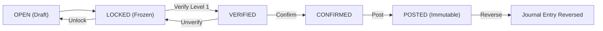

# Module: Finance (Voucher Management)

The Finance module handles all general ledger interactions, fund transfers, and financial event tracking. The primary interface for manual ledger entries is the **Voucher System**.

## 1. Voucher Types

| Type | Description | Accounting Impact |
|------|-------------|-------------------|
| **TRANSFER** | Internal fund movement between accounts (e.g., Cash to Bank). | Dr. Destination Account, Cr. Source Account |
| **RECEIPT** | Incoming funds from a contact (Customer/Partner). | Dr. Asset Account, Cr. Contact Ledger (Liability/Equity) |
| **PAYMENT** | Outgoing funds to a contact (Supplier/Partner). | Dr. Contact Ledger, Cr. Asset Account |

## 2. Transaction Lifecycle

Vouchers follow a multi-stage verification pipeline to ensure auditability and prevent unauthorized ledger mutations.

### Lifecycle Rules:
- **OPEN**: Editable and deletable.
- **LOCKED**: Read-only. Requires a `comment` to unlock back to `OPEN`.
- **POSTED**: High-integrity state. Creates a `JournalEntry` and `FinancialEvent` (if applicable). Immutable; requires a manual reversal entry for corrections.

## 3. Account Mappings

- **Financial Accounts**: Linked to a specific parent in the **Chart of Accounts (COA)**.
- **Contacts**: Each contact (Customer/Supplier) can have a `linked_account_id` in the COA for automatic ledger tracking.

## 4. Integration Points

- **POS**: Completed orders generate payments that may manifest as Vouchers or Direct Payments.
- **Inventory**: Stock movements with financial value (e.g., Adjustments) interact with the ledger via the `TransactionLifecycleService`.
