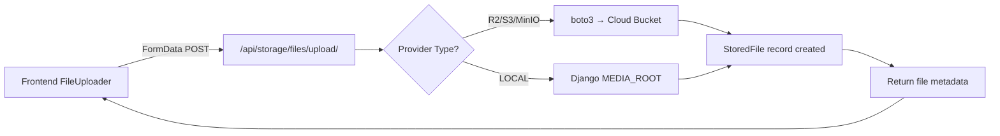

# Storage Module Documentation

## Module Overview

| Property        | Value                                        |
|-----------------|----------------------------------------------|
| Module Code     | `storage`                                    |
| Backend Path    | `erp_backend/apps/storage/`                  |
| Frontend Path   | `src/modules/storage/`                       |
| API Prefix      | `/api/storage/`                              |
| Sidebar         | System Settings → Cloud Storage              |
| Dependencies    | `boto3`, `django-storages[s3]`               |

**Goal:** Provide scalable external file storage via Cloudflare R2 (or any S3-compatible provider), with per-organization isolation, a reusable upload component, and a local development fallback.

---

## Database Tables

### `storage_storageprovider`

| Column              | Type          | Description                                    |
|---------------------|---------------|------------------------------------------------|
| `id`                | AutoField PK  | Primary key                                    |
| `organization`      | FK → Org      | Null = platform default                        |
| `provider_type`     | CharField     | `R2`, `S3`, `MINIO`, `LOCAL`                   |
| `endpoint_url`      | CharField     | S3-compatible endpoint URL                     |
| `access_key`        | CharField     | Access key ID                                  |
| `secret_key`        | CharField     | Secret access key                              |
| `bucket_name`       | CharField     | Target bucket name                             |
| `region`            | CharField     | Region (default `auto`)                        |
| `path_prefix`       | CharField     | Auto-set to `{org_slug}/`                      |
| `is_active`         | BooleanField  | Whether this provider is in use                |
| `max_file_size_mb`  | IntegerField  | Max upload size per file                       |
| `allowed_extensions`| JSONField     | Whitelist of allowed file extensions            |
| `created_at`        | DateTimeField | Auto-set on creation                           |
| `updated_at`        | DateTimeField | Auto-set on save                               |

**Reads:** Storage Settings page, all upload operations.  
**Writes:** Storage Settings page (admin configures credentials).

### `storage_storedfile`

| Column              | Type          | Description                                    |
|---------------------|---------------|------------------------------------------------|
| `uuid`              | UUIDField PK  | Public identifier for API access               |
| `organization`      | FK → Org       | Tenant isolation                               |
| `original_filename` | CharField     | Original name of uploaded file                 |
| `storage_key`       | CharField     | Full S3 object key                             |
| `bucket`            | CharField     | Bucket the file lives in                       |
| `content_type`      | CharField     | MIME type                                      |
| `file_size`         | BigIntegerField| Size in bytes                                 |
| `category`          | CharField     | ATTACHMENT, RECEIPT, INVOICE, etc.             |
| `linked_model`      | CharField     | Dotted model path (e.g. `finance.Invoice`)     |
| `linked_id`         | IntegerField  | PK of the linked record                        |
| `uploaded_by`       | FK → User      | User who uploaded                              |
| `uploaded_at`       | DateTimeField | Timestamp                                      |
| `is_deleted`        | BooleanField  | Soft-delete flag                               |
| `checksum`          | CharField     | SHA-256 hash for integrity verification         |

**Reads:** Any module listing attachments, Storage Settings page.  
**Writes:** Upload API endpoint.

---

## API Endpoints

| Method | Endpoint                          | Description                      |
|--------|-----------------------------------|----------------------------------|
| POST   | `/api/storage/files/upload/`      | Upload a file                    |
| GET    | `/api/storage/files/`             | List files (filterable)          |
| GET    | `/api/storage/files/{uuid}/`      | Get file metadata                |
| GET    | `/api/storage/files/{uuid}/download/` | Get presigned download URL   |
| DELETE | `/api/storage/files/{uuid}/`      | Soft-delete a file               |
| GET    | `/api/storage/provider/`          | Read org's storage config        |
| PUT    | `/api/storage/provider/`          | Update org's storage config      |
| POST   | `/api/storage/provider/test/`     | Test provider connectivity       |

**Query Filters (GET files):** `?category=`, `?linked_model=`, `?linked_id=`

---

## Pages

### Storage Settings (`/storage`)

| Property  | Value |
|-----------|-------|
| Goal      | Configure R2/S3 credentials and manage uploaded files |
| Reads     | `StorageProvider` (org config), `StoredFile` (file list) |
| Writes    | `StorageProvider` (save config), `StoredFile` (upload) |

**User Variables:**
- Provider type (R2 / S3 / MinIO / Local)
- Endpoint URL, Access Key, Secret Key
- Bucket name, Region, Path prefix
- Max file size, Allowed extensions

**Workflow:**
1. Page loads → fetches provider config and recent files
2. Admin clicks "Edit" → form becomes editable
3. Admin fills in R2/S3 credentials and saves
4. Admin clicks "Test Connection" to verify
5. Admin can upload files via the built-in upload panel
6. Recent files are listed with metadata

---

## Reusable Component: `<FileUploader>`

**Path:** `src/components/shared/FileUploader.tsx`

| Prop             | Type       | Description                        |
|------------------|------------|------------------------------------|
| `category`       | string     | File category (default: ATTACHMENT)|
| `linkedModel`    | string     | Dotted model path to link to       |
| `linkedId`       | number     | PK of the linked record            |
| `maxSizeMb`      | number     | Max file size in MB                |
| `acceptedTypes`  | string[]   | Allowed file extensions            |
| `multiple`       | boolean    | Allow multiple file selection      |
| `onUploadComplete` | callback | Called with file metadata on success|

**Usage Example:**
```tsx
<FileUploader
    category="INVOICE"
    linkedModel="finance.Invoice"
    linkedId={invoiceId}
    maxSizeMb={25}
    acceptedTypes={['pdf', 'jpg', 'png']}
    onUploadComplete={(file) => console.log('Uploaded:', file)}
/>
```

---

## Environment Variables

| Variable                 | Default       | Description                        |
|--------------------------|---------------|------------------------------------|
| `STORAGE_PROVIDER`       | `LOCAL`       | Default provider type              |
| `STORAGE_R2_ENDPOINT`    | (empty)       | R2/S3 endpoint URL                 |
| `STORAGE_R2_ACCESS_KEY`  | (empty)       | Access key ID                      |
| `STORAGE_R2_SECRET_KEY`  | (empty)       | Secret access key                  |
| `STORAGE_R2_BUCKET`      | `tsf-files`   | Default bucket name                |
| `STORAGE_MAX_FILE_SIZE_MB`| `50`         | Default max upload size            |

---

## Architecture Flow



---

## File Manifest

| File | Purpose |
|------|---------|
| `erp_backend/apps/storage/__init__.py` | Module init |
| `erp_backend/apps/storage/apps.py` | Django AppConfig |
| `erp_backend/apps/storage/models.py` | StorageProvider + StoredFile |
| `erp_backend/apps/storage/backends.py` | S3/R2/local upload/download/delete |
| `erp_backend/apps/storage/serializers.py` | DRF serializers |
| `erp_backend/apps/storage/views.py` | REST API views |
| `erp_backend/apps/storage/urls.py` | URL routing |
| `erp_backend/apps/storage/admin.py` | Django admin registration |
| `src/modules/storage/actions.ts` | Server actions |
| `src/modules/storage/page.tsx` | Storage settings page |
| `src/components/shared/FileUploader.tsx` | Reusable upload component |
| `src/app/(privileged)/storage/page.tsx` | Next.js page route |
