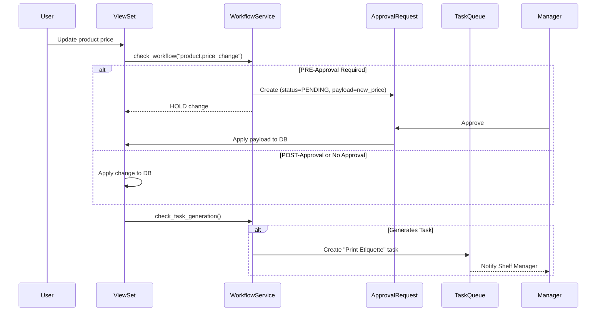

# Audit & Workflow Engine

This document defines the technical architecture for the **Universal Audit Logging** and **Conditional Approval Workflow** systems.

---

## 1. Audit Log System

### `AuditLog` Model (Django)

```python
# erp_backend/erp/models/audit.py
class AuditLog(models.Model):
    id = models.UUIDField(primary_key=True, default=uuid.uuid4)
    timestamp = models.DateTimeField(auto_now_add=True, db_index=True)
    actor = models.ForeignKey('User', on_delete=models.SET_NULL, null=True)
    actor_role = models.CharField(max_length=100, blank=True)
    action = models.CharField(max_length=10, choices=[
        ('CREATE', 'Create'), ('UPDATE', 'Update'),
        ('DELETE', 'Delete'), ('VIEW', 'View')
    ])
    table_name = models.CharField(max_length=100, db_index=True)
    record_id = models.CharField(max_length=100)
    old_value = models.JSONField(null=True, blank=True)
    new_value = models.JSONField(null=True, blank=True)
    ip_address = models.GenericIPAddressField(null=True)
    organization = models.ForeignKey('Organization', on_delete=models.CASCADE)
```

### `AuditService` Usage

```python
from erp.services.audit import AuditService

# In any ViewSet
def perform_update(self, serializer):
    old_instance = self.get_object()
    AuditService.log_event(
        actor=self.request.user,
        action='UPDATE',
        instance=old_instance,
        new_data=serializer.validated_data
    )
    serializer.save()
```

---

## 2. Approval Workflow System

### `WorkflowDefinition` Model

```python
class ApprovalMode(models.TextChoices):
    PRE = 'PRE', 'Pre-Approval (Hold until approved)'
    POST = 'POST', 'Post-Approval (Apply, then review)'

class WorkflowDefinition(models.Model):
    id = models.UUIDField(primary_key=True, default=uuid.uuid4)
    event_type = models.CharField(max_length=100, unique=True)  # e.g., "product.price_change"
    requires_approval = models.BooleanField(default=False)
    approval_mode = models.CharField(max_length=4, choices=ApprovalMode.choices, default=ApprovalMode.POST)
    approver_role = models.ForeignKey('Role', on_delete=models.SET_NULL, null=True)
    generates_task = models.BooleanField(default=False)
    task_template = models.ForeignKey('TaskTemplate', on_delete=models.SET_NULL, null=True, blank=True)
```

### `ApprovalRequest` Model

```python
class ApprovalStatus(models.TextChoices):
    PENDING = 'PENDING', 'Pending Review'
    APPROVED = 'APPROVED', 'Approved'
    REJECTED = 'REJECTED', 'Rejected'

class ApprovalRequest(models.Model):
    id = models.UUIDField(primary_key=True, default=uuid.uuid4)
    workflow = models.ForeignKey(WorkflowDefinition, on_delete=models.CASCADE)
    status = models.CharField(max_length=10, choices=ApprovalStatus.choices, default=ApprovalStatus.PENDING)
    requested_by = models.ForeignKey('User', on_delete=models.CASCADE, related_name='approval_requests')
    reviewed_by = models.ForeignKey('User', on_delete=models.SET_NULL, null=True, related_name='reviewed_approvals')
    requested_at = models.DateTimeField(auto_now_add=True)
    reviewed_at = models.DateTimeField(null=True)
    payload = models.JSONField()  # The data change to apply
    audit_log = models.ForeignKey(AuditLog, on_delete=models.SET_NULL, null=True)
```

---

## 3. Task Queue System

### `TaskTemplate` & `TaskQueue` Models

```python
class TaskTemplate(models.Model):
    id = models.UUIDField(primary_key=True, default=uuid.uuid4)
    name = models.CharField(max_length=200)  # e.g., "Print Etiquette"
    description = models.TextField(blank=True)
    default_assignee_role = models.ForeignKey('Role', on_delete=models.SET_NULL, null=True)

class TaskQueue(models.Model):
    id = models.UUIDField(primary_key=True, default=uuid.uuid4)
    template = models.ForeignKey(TaskTemplate, on_delete=models.CASCADE)
    title = models.CharField(max_length=300)
    assigned_to_role = models.ForeignKey('Role', on_delete=models.SET_NULL, null=True)
    assigned_to_user = models.ForeignKey('User', on_delete=models.SET_NULL, null=True, blank=True)
    status = models.CharField(max_length=15, choices=[
        ('PENDING', 'Pending'), ('IN_PROGRESS', 'In Progress'), ('COMPLETED', 'Completed')
    ], default='PENDING')
    source_audit_log = models.ForeignKey(AuditLog, on_delete=models.SET_NULL, null=True)
    created_at = models.DateTimeField(auto_now_add=True)
    completed_at = models.DateTimeField(null=True)
```

---

## 4. Workflow Execution Flow


