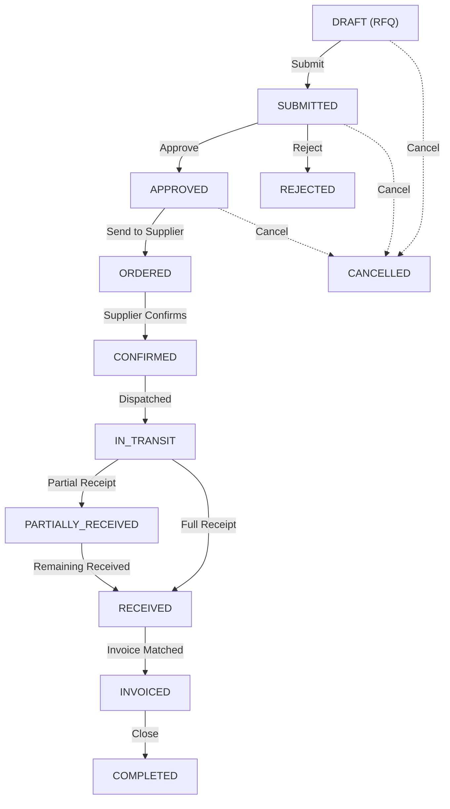
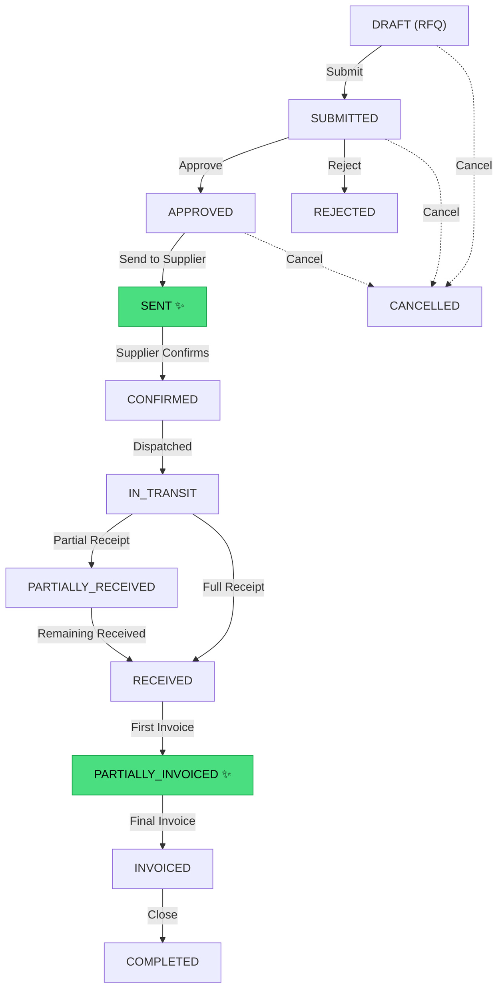
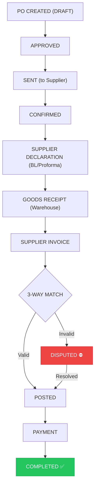

# TSFSYSTEM — Purchase Workflow Master Documentation

> Comprehensive guide covering business processes, user operations, technical implementation,
> and the 10-phase improvement roadmap for enterprise-grade procurement control.

---

## Table of Contents

1. [Goal](#1-goal)
2. [Current vs Target State](#2-current-vs-target-state)
3. [Status Life Cycle](#3-status-life-cycle)
4. [Quantity Reality Layers](#4-quantity-reality-layers)
5. [3-Way Matching & Dispute Engine](#5-3-way-matching--dispute-engine)
6. [Discrepancy Computation](#6-discrepancy-computation)
7. [Accounting Integration](#7-accounting-integration)
8. [User Guide (SOP)](#8-user-guide-sop)
9. [Technical Reference](#9-technical-reference)
10. [10-Phase Implementation Roadmap](#10-ten-phase-implementation-roadmap)

---

## 1. Goal

Make the purchase process **audit-safe**, **transparent**, and **fraud-resistant** by clearly separating and tracking **four realities** of procurement:

| Reality | Source Document | Description |
|:---|:---|:---|
| **Ordered** | Purchase Order (PO) | What the company requested from the supplier |
| **Supplier Declared** | Proforma / Bill of Lading (BL) | What the supplier claims they shipped |
| **Actually Received** | Goods Receipt Note (GRN) | What the warehouse physically counted and accepted |
| **Invoiced** | Supplier Invoice | What the supplier billed |

### Core Rule

> **Invoice quantity must never exceed the quantity actually received.**

If violated:
```
Invoice.status = DISPUTED
Invoice.payment_blocked = True
```

This ensures: **financial correctness**, **inventory accuracy**, and **full audit traceability**.

---

## 2. Current vs Target State

| Feature | Current State | Target State | Phase |
|:---|:---|:---|:---|
| PO Statuses | 12-state (DRAFT → COMPLETED) | Rename `ORDERED` → `SENT`, add `PARTIALLY_INVOICED` | 1, 3 |
| Qty Layers | `qty_received`, `qty_invoiced`, `qty_damaged`, `qty_rejected`, `qty_missing` | Add `supplier_declared_qty` | 2 |
| Multiple Invoices per PO | Not supported | Supported via `PARTIALLY_INVOICED` status | 3 |
| 3-Way Matching | Not implemented | Automatic `invoice_qty ≤ received_qty` enforcement | 4 |
| Discrepancy Engine | Partial (discrepancies tracked but not computed) | Full gap calculations with amounts | 5 |
| Invoice Dispute | `DISPUTED` exists on Sales axis only | Extend to Purchase invoices with `payment_blocked` | 6 |
| UI Discrepancy View | Not implemented | Discrepancy table with color indicators | 7 |
| Over-Receipt Protection | Hard block (`received ≤ ordered`) | Configurable tolerance (e.g. 5%) | 8 |
| Accounting | ✅ Fully implemented (Accrual model) | No change needed | 9 |
| Landed Cost | Not implemented | `LandedCost` / `LandedCostLine` models | 10 |
| Purchase Returns | Not implemented | `RETURN_REQUESTED → RETURNED` flow | 10 |
| Supplier KPIs | Not implemented | `delivery_delay`, `damage_rate`, `price_variance` | 10 |

---

## 3. Status Life Cycle

### 3.1 Current Flow (12-State)



### 3.2 Target Flow (Improved)



### 3.3 Partial Invoicing Logic

```python
if invoiced_qty == 0:
    status = 'RECEIVED'

elif invoiced_qty < received_qty:
    status = 'PARTIALLY_INVOICED'

elif invoiced_qty == received_qty:
    status = 'INVOICED'
```

---

## 4. Quantity Reality Layers

Each `PurchaseOrderLine` tracks five quantity dimensions:

| Field | Meaning | Current State |
|:---|:---|:---|
| `quantity` (ordered_qty) | Quantity requested by company | ✅ Exists |
| `supplier_declared_qty` | Quantity declared in BL or Proforma | ❌ **Missing** |
| `qty_received` (received_qty) | Quantity physically accepted into stock | ✅ Exists |
| `qty_damaged` (damaged_qty) | Quantity damaged during delivery | ✅ Exists |
| `qty_invoiced` (invoiced_qty) | Quantity billed by supplier | ✅ Exists |

Additional fields already present:
- `qty_rejected` — Rejected by warehouse (e.g. wrong spec, expired)
- `qty_missing` — Supplier failed to deliver
- `receipt_notes` — Free-text notes regarding discrepancies

### Comparison Chain

```
PO (ordered_qty)
    ↓ compare
Supplier Declaration (supplier_declared_qty)
    ↓ compare
Warehouse Receipt (received_qty + damaged_qty)
    ↓ compare
Supplier Invoice (invoiced_qty)
```

---

## 5. 3-Way Matching & Dispute Engine

### 5.1 Matching Rule

TSFSYSTEM enforces **3-way matching**:

```
Purchase Order  →  Goods Receipt  →  Supplier Invoice
```

**Core rule:**

```
invoice_qty ≤ received_qty
```

### 5.2 Dispute Detection

When an invoice is created or posted, the system evaluates each line:

```python
for line in invoice.lines:
    allowed_qty = line.received_qty - line.already_invoiced_qty

    if line.invoice_qty > allowed_qty:
        invoice.status = 'DISPUTED'
        invoice.payment_blocked = True
        break
```

### 5.3 Implementation Status

| Component | Status |
|:---|:---|
| `DISPUTED` status on Invoice | ⚠️ Exists for Sales, **needs extension to Purchases** |
| `payment_blocked` field | ❌ **Missing** — needs to be added to `Invoice` model |
| Automatic 3-way match validation | ❌ **Missing** — needs new service logic |

---

## 6. Discrepancy Computation

### 6.1 Per-Line Gaps

For every `PurchaseOrderLine`, the system calculates:

| Gap | Formula |
|:---|:---|
| `declared_gap` | `supplier_declared_qty - ordered_qty` |
| `receipt_gap_vs_declared` | `supplier_declared_qty - (received_qty + damaged_qty)` |
| `receipt_gap_vs_ordered` | `ordered_qty - (received_qty + damaged_qty)` |

### 6.2 Per-Line Amounts

| Amount | Formula |
|:---|:---|
| `received_amount` | `received_qty × unit_price` |
| `damaged_amount` | `damaged_qty × unit_price` |
| `missing_amount` | `missing_qty × unit_price` |

### 6.3 Discrepancy UI Table

| Product | Ordered | Declared | Received | Damaged | Invoiced | Difference |
|:---|:---:|:---:|:---:|:---:|:---:|:---|
| Chicken | 100 | 95 | 90 | 5 | 95 | ⛔ +5 invoiced |
| Rice | 200 | 200 | 200 | 0 | 200 | ✅ OK |
| Sugar | 50 | 50 | 45 | 3 | 42 | ⚠️ -8 missing |

**Color indicators:**

| Condition | Status |
|:---|:---|
| No discrepancy | 🟢 OK |
| Minor mismatch | 🟡 Warning |
| Invoice exceeds receipt | 🔴 **DISPUTED** |

---

## 7. Accounting Integration

### 7.1 Posting Rules (Accrual Accounting)

| Step | Account (Debit) | Account (Credit) | Status |
|:---|:---|:---|:---|
| **Goods Receipt** | Inventory (Asset) | Accrued Reception (Suspense) | ✅ Implemented |
| **Supplier Invoice** | Accrued Reception (Suspense) | Accounts Payable (Liability) | ✅ Implemented |
| **Payment** | Accounts Payable (Liability) | Cash / Bank (Asset) | ✅ Implemented |

### 7.2 Tax Treatment

| Scenario | VAT Treatment | Status |
|:---|:---|:---|
| Supplier VAT-registered + Scope `OFFICIAL` | VAT → Recoverable account | ✅ Implemented |
| VAT not recoverable | VAT → Capitalized into goods cost | ✅ Implemented |
| AIRSI withholding | Deducted from AP, posted to AIRSI Payable | ✅ Implemented |
| Reverse Charge | Input VAT + Output VAT self-assessed | ✅ Implemented |

### 7.3 Purchase Return Accounting (Target)

| Step | Account (Debit) | Account (Credit) | Status |
|:---|:---|:---|:---|
| **Return to Supplier** | Accounts Payable | Inventory | ❌ Not implemented |

---

## 8. User Guide (SOP)

### 8.1 Personae & Responsibilities

| Role | Responsibilities |
|:---|:---|
| **Purchasing Agent** | Creates POs, sends to supplier, manages communication |
| **Warehouse Staff** | Records actual received quantities, logs discrepancies |
| **Accountant** | Registers supplier invoices, manages payments |
| **Manager** | Reviews/approves POs, resolves disputes, requests credit notes |

### 8.2 Standard Purchase Flow

1. **Create PO**: Navigate to **Procurement → New Order**. Select supplier, add lines. State = `DRAFT`.
2. **Submit**: Click **Submit for Approval**. Triggers the Workspace Rules engine.
3. **Approve**: Manager approves → state becomes `APPROVED`.
4. **Send to Supplier**: Click **Send to Supplier** → state becomes `SENT`.
5. **Supplier Confirms**: Supplier confirms via portal or manual update → `CONFIRMED`.
6. **Receive Goods**: Warehouse uses **Receive Goods** action line-by-line.
    - Log damaged, rejected, or missing quantities.
7. **Invoice**: Register supplier invoice → system performs 3-way match.
    - If valid → `INVOICED`
    - If invalid → `DISPUTED`, payment blocked.
8. **Payment**: Accountant processes payment → `COMPLETED`.

### 8.3 Handling Disputes

When an invoice is disputed:

1. **Review**: Manager reviews the discrepancy table.
2. **Resolve** via one of:
   - Adjust invoice quantities.
   - Request supplier credit note.
   - Initiate purchase return.
3. **Clear**: Dispute cleared → invoice re-posted → payment unblocked.

All dispute actions are logged in the audit trail.

### 8.4 Configuring Approval Rules

Approval workflows are governed by the **Workspace Rules Engine** (`AutoTaskRule`).

| Parameter | Value |
|:---|:---|
| **Trigger** | `PURCHASE_ENTERED` |
| **Conditions** | `{"min_amount": 5000}` |
| **Action** | Auto-generates task for the assigned role/user |

> [!TIP]
> To create a $5,000 approval limit, configure an `AutoTaskRule` with `trigger_event='PURCHASE_ENTERED'` and `conditions={"min_amount": 5000}`.

### 8.5 Over-Receipt Protection

```
received_qty ≤ ordered_qty + tolerance
```

Default tolerance: **5%** (configurable per organization).

---

## 9. Technical Reference

### 9.1 Data Models

| Model | File | Purpose |
|:---|:---|:---|
| [PurchaseOrder](file:///root/.gemini/antigravity/scratch/TSFSYSTEM/erp_backend/apps/pos/models/purchase_order_models.py) | `purchase_order_models.py` | Document header with lifecycle state |
| [PurchaseOrderLine](file:///root/.gemini/antigravity/scratch/TSFSYSTEM/erp_backend/apps/pos/models/purchase_order_models.py) | `purchase_order_models.py` | Line items with qty tracking |
| [Invoice](file:///root/.gemini/antigravity/scratch/TSFSYSTEM/erp_backend/apps/finance/invoice_models.py) | `invoice_models.py` | Shared model (`type='PURCHASE'`) |
| [AutoTaskRule](file:///root/.gemini/antigravity/scratch/TSFSYSTEM/erp_backend/apps/workspace/models.py) | `workspace/models.py` | Rules engine for approval limits |

### 9.2 Service Layer

| Service | File | Key Methods |
|:---|:---|:---|
| [PurchaseService](file:///root/.gemini/antigravity/scratch/TSFSYSTEM/erp_backend/apps/pos/services/purchase_service.py) | `purchase_service.py` | `create_purchase_order()`, `receive_po()`, `invoice_po()`, `quick_purchase()` |
| [auto_task_service](file:///root/.gemini/antigravity/scratch/TSFSYSTEM/erp_backend/apps/workspace/auto_task_service.py) | `auto_task_service.py` | `fire_auto_tasks()` — condition matching engine |

### 9.3 Event Bus Contracts

| Event | Emitted When | Handlers |
|:---|:---|:---|
| `PURCHASE_ENTERED` | PO submitted | Workspace → auto-task creation |
| `PO_APPROVED` | PO approved | Workspace → notify assigned users |
| `DELIVERY_COMPLETED` | PO fully received | Workspace → follow-up tasks |
| `PURCHASE_NO_ATTACHMENT` | PO received without invoice | Workspace → reminder task |
| `BARCODE_MISSING_PURCHASE` | Product received without barcode | Workspace → barcode assignment task |

### 9.4 API Endpoints

| Endpoint | Method | Action |
|:---|:---|:---|
| `/api/pos/purchase-orders/` | GET | List POs |
| `/api/pos/purchase-orders/` | POST | Create PO |
| `/api/pos/purchase-orders/{id}/submit/` | POST | Submit for approval |
| `/api/pos/purchase-orders/{id}/approve/` | POST | Approve PO |
| `/api/pos/purchase-orders/{id}/reject/` | POST | Reject PO |
| `/api/pos/purchase-orders/{id}/send-to-supplier/` | POST | Mark as sent |
| `/api/pos/purchase-orders/{id}/receive-line/` | POST | Receive goods for a line |
| `/api/pos/purchase-orders/{id}/mark-invoiced/` | POST | Mark as invoiced |
| `/api/pos/purchase-orders/{id}/complete/` | POST | Close the PO |
| `/api/pos/purchase-orders/{id}/cancel/` | POST | Cancel the PO |
| `/api/pos/purchase-orders/auto-replenish/` | POST | Run Min/Max replenishment engine |
| `/api/pos/purchase-orders/dashboard/` | GET | PO stats by status |

---

## 10. Ten-Phase Implementation Roadmap

### Phase 1 — Normalize Terminology ⚙️

**Change**: Rename `ORDERED` → `SENT` in `STATUS_CHOICES` and `VALID_TRANSITIONS`.

| Current | New | Meaning |
|:---|:---|:---|
| `APPROVED` | `APPROVED` | Internal approval complete |
| `ORDERED` | `SENT` | PO sent to supplier |
| `CONFIRMED` | `CONFIRMED` | Supplier confirmed order |

**Impact**: Migration + frontend label update. Low risk.

---

### Phase 2 — Introduce Quantity Reality Layers ⚙️

**Change**: Add `supplier_declared_qty` field to `PurchaseOrderLine`.

```diff
 # Quantities
 quantity = models.DecimalField(...)        # ordered_qty
+supplier_declared_qty = models.DecimalField(max_digits=15, decimal_places=2, default=Decimal('0.00'))
 qty_received = models.DecimalField(...)    # received_qty
 qty_invoiced = models.DecimalField(...)    # invoiced_qty
```

**Impact**: New migration, no breaking changes.

---

### Phase 3 — Multiple Invoices per PO ⚙️

**Change**: Add `PARTIALLY_INVOICED` status.

```diff
 STATUS_CHOICES = (
     ...
     ('RECEIVED', 'Fully Received'),
+    ('PARTIALLY_INVOICED', 'Partially Invoiced'),
     ('INVOICED', 'Invoiced'),
     ...
 )
```

**Impact**: New status + transition rules update.

---

### Phase 4 — 3-Way Matching ⚙️

**Change**: New `ThreeWayMatchService` with validation logic.

```python
class ThreeWayMatchService:
    @staticmethod
    def validate_invoice(invoice):
        for line in invoice.lines:
            po_line = line.purchase_order_line
            allowed = po_line.qty_received - po_line.qty_invoiced
            if line.quantity > allowed:
                invoice.status = 'DISPUTED'
                invoice.payment_blocked = True
                invoice.save()
                return False
        return True
```

**Impact**: New service, hook into invoice creation flow.

---

### Phase 5 — Discrepancy Computation Engine ⚙️

**Change**: Computed properties on `PurchaseOrderLine`.

**Impact**: No model changes — computed fields only.

---

### Phase 6 — Invoice Dispute Detection ⚙️

**Change**: Add `payment_blocked` field to `Invoice` model. Wire `ThreeWayMatchService` into `invoice_po()`.

```diff
 class Invoice(TenantOwnedModel):
+    payment_blocked = models.BooleanField(default=False)
```

**Impact**: New migration + service wiring.

---

### Phase 7 — Discrepancy UI Visibility 🎨

**Change**: Frontend-only. Add discrepancy table to PO detail view.

**Impact**: No backend changes.

---

### Phase 8 — Logistics Integrity ⚙️

**Change**: Configurable over-receipt tolerance. Enforce `location_id` on receipts.

**Impact**: Config key + validation logic update.

---

### Phase 9 — Accounting Integration ✅

**Status**: Already fully implemented. No changes required.

---

### Phase 10 — Future Enhancements ⚙️

| Enhancement | New Models | Status |
|:---|:---|:---|
| **Landed Cost** | `LandedCost`, `LandedCostLine` | ❌ Not started |
| **Purchase Returns** | `PurchaseReturn`, `PurchaseReturnLine` | ❌ Not started |
| **Supplier KPIs** | Computed from existing data | ❌ Not started |
| **Document Attachments** | `PurchaseAttachment` | ❌ Not started |

#### Landed Cost Formula

```
unit_landed_cost = (product_cost × qty + freight + customs) / qty
```

#### Purchase Return Flow

```
RECEIVED → RETURN_REQUESTED → RETURNED
```

#### Supplier Performance Metrics

```
supplier_delivery_delay
supplier_damage_rate
supplier_price_variance
```

---

## Complete Workflow Summary



---

## Result After Full Implementation

| Capability | Description |
|:---|:---|
| **Full Traceability** | Every product line shows: `Ordered → Declared → Received → Invoiced` |
| **Automatic Fraud Protection** | Suppliers cannot invoice goods not received |
| **Accurate Inventory Valuation** | Stock value reflects real warehouse quantities |
| **Strong Audit Compliance** | Auditors can trace every discrepancy and verify disputed invoices were blocked |
| **Enterprise-Level Procurement** | Same integrity model as SAP / Oracle |
